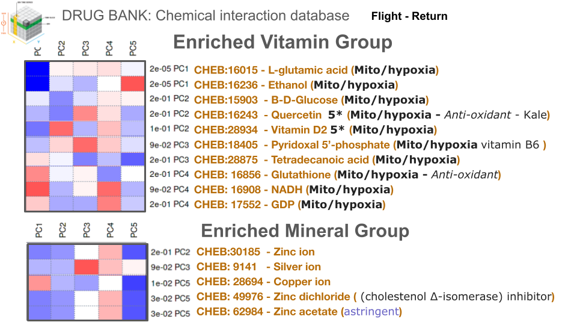
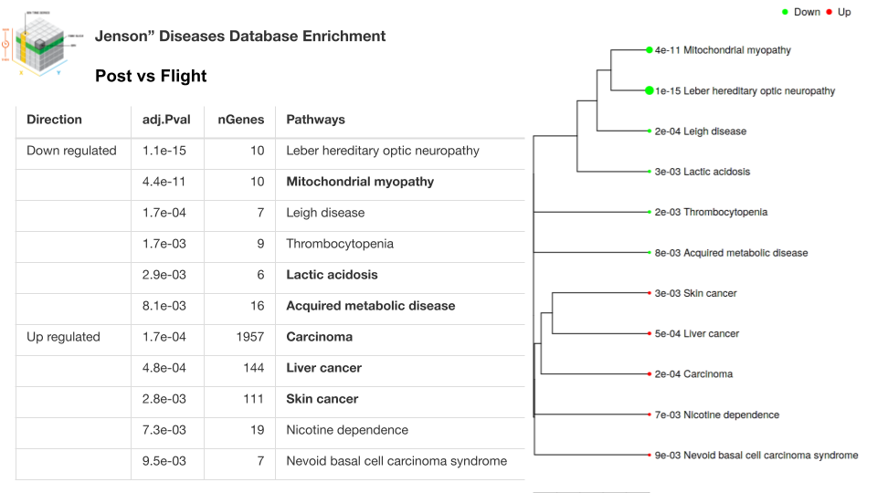
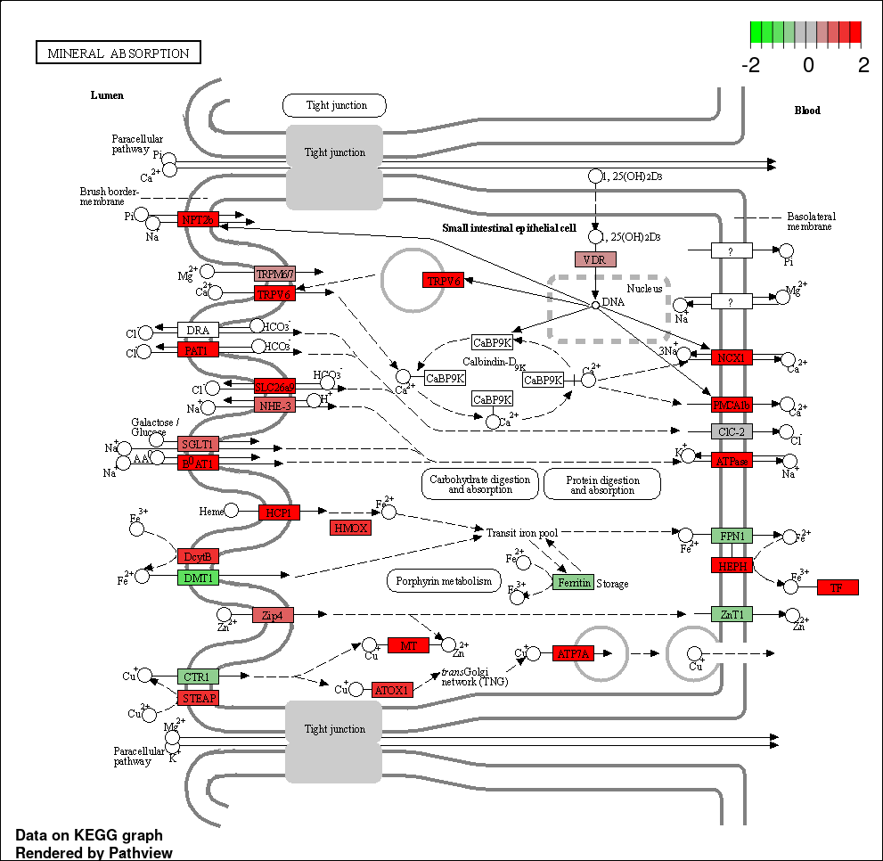
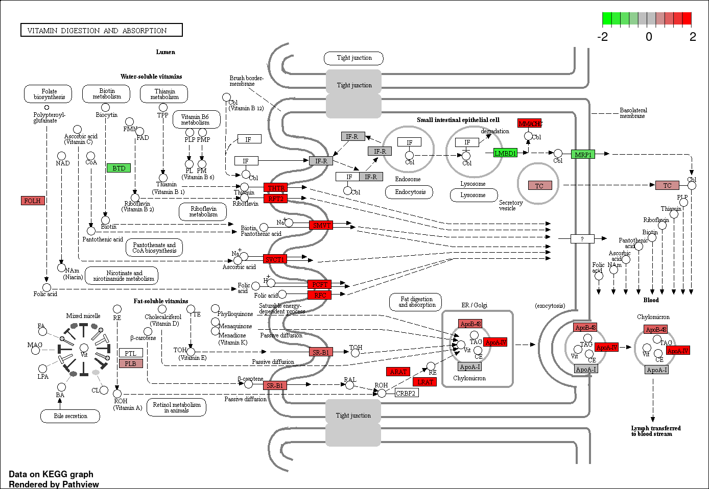

# Draft 1: H2AI \~ “Eat Bananas and kale after space flight to reduce the impact of re-entry to 1G”

**Abstract:** Eating bananas and kale after high-intensity sports or space flight can be beneficial for your health for several reasons. Firstly, bananas are a good source of carbohydrates, potassium, and other important nutrients such as vitamin C and vitamin B6. Secondly, kale is a nutrient-dense vegetable that is rich in antioxidants, fibre, and a variety of vitamins and minerals. Eating kale after exercise or spaceflight can help to reduce inflammation in the body and support the immune system. The antioxidants in kale can help to protect against oxidative stress, which is a type of cellular damage that can occur during high-intensity exercise or exposure to radiation during spaceflight. In summary, eating bananas and kale after high-intensity sports or space flight can provide important nutrients, support healthy digestion and immune function, and reduce inflammation and oxidative stress in the body.

## **Introduction:**

**Analysis of astronauts from the Jaxa reveals signs of oxidative stress and related pathways.**&#x20;

[Slides show summary](https://docs.google.com/presentation/d/159TmKeoebDlhbi4-e7l8rn7it7BpBr60-8cdKSIBBS8/edit?usp=sharing)



**Methods:** JAXA6 (GLDS-530) statistical reanalysis using GAGE gene set enrichment correlation analysis, Principal component pathways correlation analysis with DRUG bank chemical interaction library and changes to the vitamin and mineral absorption pathways using KEGG pathview. Linear model of flight vs post mission was used to calculate differential expression using DESeq2 **(REF)**.

**Results:** Evidence for increased need for K/Na+ and vitamins after spaceflight missions.

**Discussion:**&#x20;

**Mitochondria response to hypoxia**

Hypoxia is a condition in which the body or a specific tissue is deprived of oxygen. When mitochondria are exposed to hypoxia, they can respond by increasing their production of ATP. This can help cells to maintain their energy levels and continue to function properly in the face of reduced oxygen availability. In addition, mitochondria can also produce molecules called reactive oxygen species (ROS) during hypoxia. These molecules can act as signaling molecules, helping cells to adapt to the low oxygen conditions and potentially stimulating the growth of new blood vessels to improve oxygen delivery to the tissue.

**Mitochondria adapt to elevated CO2**

Mitochondria are the powerhouses of the cell, responsible for generating the majority of the cell's energy in the form of ATP. When cells are exposed to elevated levels of CO2, the mitochondria can adapt by increasing their activity and the rate at which they produce ATP. This can help cells to maintain their energy levels and continue to function properly in the face of increased CO2 levels.

**Chloroplast response to elevated CO2**

Chloroplasts are the organelles within plant cells that are responsible for photosynthesis, the process by which plants convert light energy into chemical energy. When plants are exposed to elevated levels of CO2, the chloroplasts can respond by increasing their activity and the rate at which they carry out photosynthesis. This can help plants to maintain their growth and productivity in the face of increased CO2 levels. In addition, elevated CO2 levels can also stimulate the synthesis of certain plant hormones, such as auxins, which can promote plant growth and development.

**What cofactors are required for healthy chloroplast function?**

Chloroplasts are the organelles in plant cells where photosynthesis takes place. In order for chloroplasts to function properly and carry out photosynthesis efficiently, they require several cofactors, which are non-protein molecules that are essential for the activity of enzymes involved in photosynthesis. Some of the cofactors that are required for healthy chloroplast function include: Chlorophyll, Carotenoids, Phycobilins, Cytochromes, and Iron-sulfur (Fe-S) clusters. These cofactors help to transfer electrons and protons during the process of photosynthesis, allowing chloroplasts to convert light energy into chemical energy. A deficiency or imbalance of these cofactors can lead to reduced photosynthetic activity and impaired chloroplast function.

In the analysis, a prominent correlation was observed among the initial five principal components and the requisite vitamins and minerals for mitochondrial functionality, as detailed in Figure XX. The metabolites identified in this correlation include Glutamic Acid, Ethanol, B-D-Glucose, Quercetin, Vitamin D2, Vitamin B6, Tetradecanoic Acid, Glutathione, NAD, and GDP. Additionally, the minerals associated with this correlation encompass Zinc Ion, Silver Ion, Copper Ion, Zinc Dichlorvos, and Zinc Acetate. This finding underscores the intricate relationship between specific nutrients and mitochondrial health, highlighting the potential for targeted nutritional interventions to support mitochondrial function.

<figure><figcaption></figcaption></figure>

**Figure X:** Statistical analysis of principle component analysis correlation of the JAXA cellfree RNAseq (GLDS-530) normalized counts with the DRUG BANK chemical interaction database.

**Some vitamins may function in the chloroplast**

Plants are able to produce a variety of vitamins, but these vitamins are not typically produced in the chloroplasts. Chloroplasts are the organelles in plant cells where photosynthesis takes place. During photosynthesis, chloroplasts convert light energy into chemical energy, which is then used to produce glucose and other organic molecules. While vitamins are not directly produced in the chloroplasts, they can be synthesized from the organic molecules produced during photosynthesis.

Vitamins are essential nutrients that are required in small amounts for the proper functioning of the human body. They can be divided into two main categories: fat-soluble vitamins (such as vitamins A, D, E, and K) and water-soluble vitamins (such as vitamins B and C). While plants are able to synthesize some vitamins, such as vitamin C, they are not able to produce all of the vitamins that are essential for human health. As a result, it is important for people to obtain a balanced and varied diet that includes a variety of sources of vitamins.

**Vitamins function as cofactors**

Vitamins are essential nutrients that are required in small amounts for the proper functioning of the human body. They function as cofactors for enzymes, which are proteins that catalyze chemical reactions in the body. By assisting in the activity of enzymes, vitamins help to support a wide range of physiological processes, including metabolism, growth, and development. Vitamins can function as cofactors for enzymes in many different parts of the cell, depending on the specific function of the enzyme and the vitamin. Some vitamins, such as vitamin A, function as cofactors for enzymes in the cytoplasm, which is the gel-like substance inside cells where many metabolic reactions take place. Other vitamins, such as vitamin C, can function as cofactors for enzymes in the mitochondria, which are the organelles in cells that are responsible for producing energy. In general, vitamins function as cofactors for enzymes wherever the enzymes are located within the cell. By assisting in the activity of enzymes, vitamins help to support the many different physiological processes that are essential for the health and function of the body.

**Location of vitamin function**

Vitamins are essential nutrients that are required in small amounts for the proper functioning of the human body. They can be divided into two main categories: fat-soluble vitamins (such as vitamins A, D, E, and K) and water-soluble vitamins (such as vitamins B and C). Vitamins function throughout the body, and each vitamin has specific roles and functions. For example, vitamin A is important for vision and the maintenance of healthy skin, while vitamin D helps the body to absorb calcium and maintain strong bones. Vitamin C is important for the production of collagen and the maintenance of healthy skin and blood vessels, while vitamin E acts as an antioxidant and helps to protect cells from damage. In general, vitamins function by acting as cofactors for enzymes, which are proteins that catalyze chemical reactions in the body. By assisting in the activity of enzymes, vitamins help to support a wide range of physiological processes, including metabolism, growth, and development.

**Vitamins D and vitamin K function as cofactors in the cell**

Vitamins D and K are two fat-soluble vitamins that are essential for the proper functioning of the human body. They function as cofactors for enzymes, which are proteins that catalyze chemical reactions in the body. By assisting in the activity of enzymes, vitamins D and K help to support a wide range of physiological processes, including metabolism, growth, and development.

Vitamin D is a hormone that is involved in the regulation of calcium and phosphorus metabolism. It functions as a cofactor for enzymes that are involved in the absorption of calcium from the intestines, the mobilization of calcium from the bones, and the regulation of calcium levels in the blood. Vitamin D is also involved in the regulation of the immune system, and it functions as a cofactor for enzymes that are involved in immune cell activation and function.

Vitamin K is involved in the synthesis of proteins that are essential for blood clotting and bone metabolism. It functions as a cofactor for enzymes that are involved in the modification of certain amino acids in proteins, which is necessary for the proper function of these proteins. Vitamin K is also involved in the regulation of calcium metabolism, and it functions as a cofactor for enzymes that are involved in the incorporation of calcium into bone.

In general, vitamins D and K function as cofactors for enzymes in many different parts of the cell, depending on the specific function of the enzyme and the vitamin. Some enzymes that require vitamins D and K as cofactors may be located in the cytoplasm, while others may be located in organelles such as the mitochondria or the endoplasmic reticulum. By assisting in the activity of enzymes, vitamins D and K help to support the many different physiological processes that are essential for the health and function of the body.

**Byproducts made during anaerobic respiration**

Anaerobic respiration is a type of cellular respiration that occurs in the absence of oxygen. During anaerobic respiration, cells convert the chemical energy stored in organic molecules into ATP, the cell's primary energy currency. In the absence of oxygen, cells use other electron acceptors, such as sulfate or nitrate, instead of oxygen to complete the electron transport chain and generate ATP. The byproducts of anaerobic respiration vary depending on the specific electron acceptor that is used. For example, if sulfate is used as the electron acceptor, the byproducts of anaerobic respiration will include sulfur and hydrogen sulfide. If nitrate is used as the electron acceptor, the byproducts will include nitrogen and nitrogen oxides.

GAGE analysis is a powerful tool that allows researchers to examine gene expression patterns across a genome. In the context ofspace flight response, this study has employed GAGE analysis to identify genes whose expression levels are significantly altered in the post mission state compared tothe samples take when on orbit. Interestingly, these differentially expressed genes appear to be relevant not only to Jensen disease, but also to a wider spectrum of conditions.&#x20;

**Leber's optic neuropathy, mitochondrial myopathy, Leigh syndrome, thrombocytopenia and lactic acidosis:** These conditions all involve dysfunction in the mitochondria, the cell's powerhouses. The abnormal gene expression patterns identified in Jensen disease may provide insights into the underlying mechanisms shared by these mitochondrial disorders.&#x20;

**Carcinoma:** This is a general term for cancer, and the finding suggests a potential link between the genes deregulated in Jensen disease and an increased risk of developing certain cancers.&#x20;

**Liver, skin, and basal cell carcinomas:** The study specifically identified an association with these specific types of cancers.\

GAGE analysis correlating with Jensen disease patterns highlights differentially expressed genes linked to a range of diseases. These include Leber's optic neuropathy, mitochondrial myopathy, Leigh syndrome, thrombocytopenia and lactic acidosis carcinoma. Additionally, a significant association with various cancers such as liver, skin, and basal cell carcinomas is observed (refer to figure XX).

<figure><figcaption></figcaption></figure>

**Figure XX:** Statistical analysis of liner model (flight vs post mission) showing pathway enrichment in the JAXA cellfree RNAseq (GLDS-530) normalized counts using the Jenseon disease database..

### **Lactic acid is produced by organisms**

Lactic acid is a type of organic acid that is produced by a wide variety of organisms, including plants. In plants, lactic acid is typically produced in the cytosol, the fluid-filled region of the cell that contains the organelles and other cellular structures. Lactic acid can be produced by plants under a variety of conditions, including during periods of stress, such as drought or high light intensity, or in response to infection by pathogenic microbes. Lactic acid production may also be increased during certain developmental stages, such as fruit ripening, when it may play a role in the development of flavor and aroma compounds.

### **What is acidosis?**

Acidosis is a condition in which the pH of the body's fluids, including the blood, becomes too acidic. Normal blood pH is between 7.35 and 7.45, and values below 7.35 are considered acidic. Acidosis can be caused by a variety of factors, including excessive production of acid by the body, loss of bicarbonate from the body, or impaired excretion of acid by the kidneys. Acidosis can be divided into two main types: respiratory acidosis, which is caused by impaired breathing, and metabolic acidosis, which is caused by an excess of acid in the body or a loss of bicarbonate. Acidosis can be a serious condition and can lead to a variety of complications, such as coma and organ failure.

### **Links between abiotic stress and lactic acid accumulation**

Abiotic stress refers to the negative effects on an organism's growth, development, and survival that are caused by non-living factors, such as extreme temperatures, drought, or soil salinity. Lactic acid is an organic acid that is produced by many different organisms, including plants. There is some evidence to suggest that abiotic stress can affect the production and accumulation of lactic acid in plants. For example, studies have shown that drought stress can increase the production of lactic acid in plant leaves, while high temperatures can decrease lactic acid production. Additionally, lactic acid has been shown to play a role in plant responses to abiotic stress, such as by enhancing the plant's tolerance to drought and high temperatures. Overall, there appears to be a link between abiotic stress and lactic acid accumulation in plants, but more research is needed to fully understand the mechanisms involved.

### **The link between the circadian rhythm and lactic acid production**

The circadian rhythm is the internal biological clock that regulates the sleep-wake cycle and many other physiological processes in living organisms. Lactic acid is an organic acid that is produced by many different organisms, including plants. There is no direct link between the circadian rhythm and lactic acid accumulation in plants. Lactic acid is produced in plants as a byproduct of cellular metabolism and is used in a variety of processes, such as growth and defense against pests and diseases. The production of lactic acid in plants is not directly regulated by the circadian rhythm. However, it is possible that the circadian rhythm may indirectly affect the production and accumulation of lactic acid in plants by regulating other physiological processes that are involved in lactic acid metabolism.

### **Lactic acid production in humans**

Lactic acid is produced by a wide variety of organisms, including humans. In humans, lactic acid is typically produced in the muscles and red blood cells. Lactic acid is produced during the process of anaerobic respiration, which is a type of cellular respiration that occurs in the absence of oxygen. This process occurs when the demand for oxygen in the body's tissues exceeds the supply, and is typically seen during intense or prolonged physical activity. During anaerobic respiration, lactic acid is produced as a byproduct of the breakdown of glucose, and is then transported to the liver, where it can be converted into other molecules, such as glucose or glycogen, that can be used as energy sources by the body.

### **Cofactors required for healthy and efficient mitochondria function**

Mitochondria are the cell's energy-producing organelles, and their function requires several cofactors, including vitamins and minerals. For mitochondria to function properly and produce energy efficiently, they require several cofactors, which are non-protein molecules that are essential for the activity of enzymes involved in cellular respiration. Some of the key cofactors required for efficient mitochondria function include vitamins B1, B2, B3, and B5, as well as minerals such as magnesium, calcium, iron, and zinc. Some other cofactors that are required for healthy mitochondria function include: Nicotinamide adenine dinucleotide (NAD), Flavoproteins, Coenzyme Q, Iron-sulfur (Fe-S) clusters, Thiamine pyrophosphate (TPP). These cofactors help to transfer electrons and protons during the process of cellular respiration, allowing mitochondria to produce energy in the form of ATP. A deficiency or imbalance of these cofactors can lead to reduced energy production and impaired mitochondria function. These cofactors are involved in a variety of processes within the mitochondria, including the synthesis of ATP, the body's primary energy-carrying molecule, and the production of heat. Deficiencies of these cofactors can impair the mitochondria's ability to carry out these functions, leading to a range of symptoms, including fatigue, weakness, and muscle pain. Ensuring adequate intake of these cofactors is important for maintaining healthy mitochondria function and overall health.

### Enhanced Absorption of Vitamins and Minerals in Astronauts

KEGG pathway analysis has highlighted a significant upregulation in the pathways associated with the absorption of vitamins and minerals. This upregulation is indicated by the higher expression levels of genes involved in the absorption processes. Notably, these findings are derived from cell-free RNA samples. Despite the extracellular origin of these RNA samples, it is plausible to consider that this augmented gene expression reflects an increased absorptive activity within the astronauts' stomachs. This suggests that the unique conditions of spaceflight may influence nutrient absorption mechanisms at the genetic level.

<figure><figcaption></figcaption></figure>

<figure><figcaption></figcaption></figure>

**Figure X:** Statistical analysis of linear model (flight vs post mission) showing pathway enrichment in the JAXA cellfree RNAseq (GLDS-530) normalized counts using the KEGG pathway database.

**Lactic acid processing in humans**

In humans, lactic acid is produced by the muscles during intense physical activity, such as exercise. It is then transported to the liver, where it is converted into glucose or stored as glycogen. This process, known as glyconeogenesis, helps to maintain blood sugar levels and provide the body with a source of energy. Lactic acid can also be produced by the bacteria in the large intestine, where it is fermented to produce short-chain fatty acids. These fatty acids are then absorbed by the body and used as an energy source or stored for later use. Overall, lactic acid is produced and processed in different parts of the human body, depending on the specific circumstances and the needs of the body at the time.

**Symptoms associated with hypoxia and lactic acid accumulation**

Hypoxia is a condition in which the body or a specific part of the body is deprived of adequate oxygen supply. Lactic acid is an organic acid that is produced by the body as a byproduct of cellular metabolism. There are several known symptoms associated with hypoxia and lactic acid accumulation, including shortness of breath, rapid breathing, and fatigue. In severe cases, hypoxia can cause confusion, dizziness, and loss of consciousness. Lactic acid accumulation can also cause symptoms such as muscle cramps and pain, as well as a feeling of weakness and fatigue. In severe cases, lactic acid accumulation can lead to a condition called lactic acidosis, in which the blood becomes excessively acidic. Lactic acidosis can cause symptoms such as rapid breathing, confusion, and coma. It is important to seek medical attention if you experience any of these symptoms, as they can be signs of serious long term effects.

**Linking hypoxia to pathways related to cancer**

<figure><figcaption></figcaption></figure>

**Known symptoms associated with astronauts going to space**

There are several known symptoms that are associated with astronauts going to space, including weightlessness, changes in vision, and loss of bone density. Weightlessness, or the lack of gravity, can cause a number of physical changes in the human body, such as fluid shifts and changes in muscle and bone mass. These changes can result in symptoms such as dizziness, nausea, and disorientation. Changes in vision, such as nearsightedness and changes in the shape of the eyeball, are also common in astronauts. Finally, loss of bone density is a common problem in astronauts, as the weightless environment of space causes the bones to lose minerals and become weaker. Other symptoms that may be experienced by astronauts in space include sleep disturbance, fatigue, and changes in the immune system.

**Conclusion**

In summary, eating bananas and kale after high intensity sports or space flight can provide important nutrients, support healthy digestion and immune function, and reduce inflammation and oxidative stress in the body.

**References**

**Pathview reference**

**IDEP0.96**

**Acknowledgement:** Perplexity AI GTP4< for a conversation about the possible meaning of these data.

